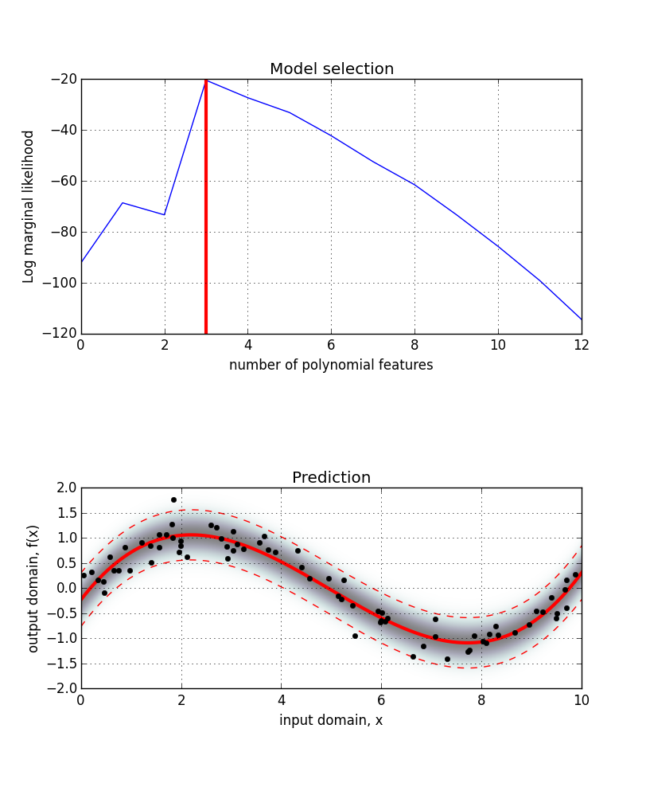

Bayesian Linear Model
================================================================================

**Author**: Asher Bender

**Date**: June 2015

**License**: `Apache License Version 2.0 <http://www.apache.org/licenses/LICENSE-2.0>`_

Overview
--------------------------------------------------------------------------------

This code implements the `Bayesian linear model
<http://en.wikipedia.org/wiki/Bayesian_linear_regression>`_ `[1, 2, 3]
<https://github.com/asherbender/bayesian-linear-model#references>`_. Treating
linear models under a Bayesian framework allows:

* parameter estimation (learning coefficients of the linear model)
* performing prediction
* model selection

These features are demonstrated in the figure below where the task is to learn a
polynomial approximation of a noisy `sine <http://en.wikipedia.org/wiki/Sine>`_
function:

The top subplot shows the log marginal likelihood after fitting polynomials of
increasing complexity (degrees) to the data. The model with the highest log
marginal likelihood is marked by the vertical red line. The benefit of Bayesian
model selection, over maximum likelihood methods, is that maximising the log
marginal likelihood (model evidence) tends to avoid over-fitting during model
selection. This is due to a model complexity penalty in the marginal likelihood
equation that preferences simpler models. The optimal model will provide a
balance between data-fit and model complexity, leading to better generalisation.

The bottom subplot shows the noisy sine data (black dots) and predictions from
the model (solid red line), including a 95% confidence bound (dashed red
line). The background intensity plot illustrates the posterior likelihood of
data in the model. The model used in the bottom plot is the model recommended in
the top plot.

The code used to produce this figure is provided in the `Example
<https://github.com/asherbender/bayesian-linear-model#example>`_ section.

Dependencies
--------------------------------------------------------------------------------

The following libraries are used in the Bayesian linear model module:

* Python
* Numpy
* Scipy
* Sphinx

The following libraries are used in the example code but are *not* requirements
of the Bayesian linear model module:

* Matplotlib
* Sklearn

Installation
--------------------------------------------------------------------------------

This code supports installation using pip (via `setuptools
<https://pypi.python.org/pypi/setuptools>`_). To install from the git
repository:

.. code-block:: bash

    git clone https://github.com/asherbender/bayesian-linear-model
    cd bayesian-linear-model
    sudo pip install .

To generate the Sphinx documentation:

.. code-block:: bash

    cd doc/
    make html

The entry point of the documentation can then be found at:

.. code-block:: bash

    build/html/index.html

To uninstall the package:

.. code-block:: bash

    pip uninstall linear_model

.. _example-code:

Example
--------------------------------------------------------------------------------

For a tutorial on the Bayesian linear model refer to the IPython Notebook
provided in ``example/Bayesian Linear Regression.ipynb``.

The following code is a short demonstration of how to use the
``BayesianLinearModel()`` class for model selection and inference. A copy of
this code is included in ``example/example.py``. This code was used to produce
the `example figure
<https://github.com/asherbender/bayesian-linear-model#overview>`_:

.. code-block:: python

    import numpy as np
    from matplotlib import cm
    import matplotlib.pyplot as plt
    from linear_model import BayesianLinearModel
    from sklearn.preprocessing import PolynomialFeatures
    np.random.seed(42)

    # Create polynomial features in basis function expansion.
    polybasis = lambda x, p: PolynomialFeatures(p).fit_transform(x)

    # Create sine function.
    func = lambda x: np.sin(((2*np.pi)/10)*x)

    # Create random sin() data.
    N = 75
    noise = 0.25
    X = np.sort(np.random.uniform(0, 10, N)).reshape((N, 1))
    y = func(X) + np.random.normal(scale=noise, size=(N, 1))

    # Calculate log marginal likelihood (model evidence) for each model.
    lml = list()
    for d in range(13):
        blm = BayesianLinearModel(basis=lambda x: polybasis(x, d))
        blm.update(X, y)
        lml.append(blm.evidence())

    # Perform model selection by choosing the model with the best fit.
    D = np.argmax(lml)
    blm = BayesianLinearModel(basis=lambda x: polybasis(x, D))
    blm.update(X, y)

    # Perform inference in the model.
    x_query = np.linspace(0, 10, 1000)[:, None]
    y_query = np.linspace(-2, 2, 500)
    mu, S2, l = blm.predict(x_query, y=y_query, variance=True)

    # Plot model selection.
    f, (ax1, ax2) = plt.subplots(2, 1, figsize=(8, 10))
    f.subplots_adjust(hspace=0.5)
    ax1.plot(range(len(lml)), lml)
    ax1.set_title('Model selection')
    ax1.set_xlabel('number of polynomial features')
    ax1.set_ylabel('Log marginal likelihood')
    ax1.axvline(D, color='r', linewidth='3')
    ax1.grid('on')

    # Plot model predictions.
    ext = [0, 10, -2., 2.]
    ax2.imshow(l, origin='lower', extent=ext, cmap=cm.bone_r, alpha=0.5)
    ax2.plot(x_query, mu + S2, 'r--', linewidth=1)
    ax2.plot(x_query, mu, 'r', linewidth=3)
    ax2.plot(x_query, mu - S2, 'r--', linewidth=1)
    ax2.plot(X, y, 'k.', markersize=10)
    ax2.set_title('Prediction')
    ax2.set_xlabel('input domain, x')
    ax2.set_ylabel('output domain, f(x)')
    ax2.grid('on')
    plt.show()

References
--------------------------------------------------------------------------------

The Bayesian linear model module was created using the following references:

.. _[1]: http://www.cs.ubc.ca/~murphyk/MLbook/
.. _[2]: http://research.microsoft.com/en-us/um/people/cmbishop/prml/
.. _[3]: http://www.cs.ubc.ca/~murphyk/Papers/bayesGauss.pdf

`[1]`_ Murphy, K. P., Machine learning: A probabilistic perspective,
       The MIT Press, 2012

`[2]`_ Bishop, C. M, Pattern Recognition and Machine Learning (Information Science and Statistics),
       Jordan, M.; Kleinberg, J. & Scholkopf, B. (Eds.), Springer, 2006

`[3]`_ Murphy, K. P., Conjugate Bayesian analysis of the Gaussian distribution,
       Department of Computer Science, The University of British Columbia, 2007
